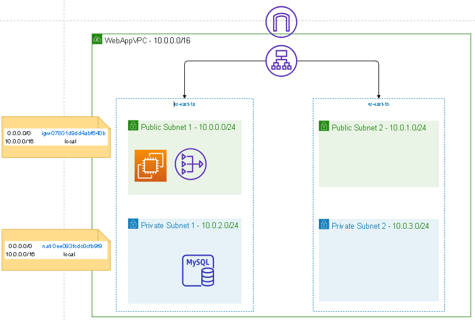
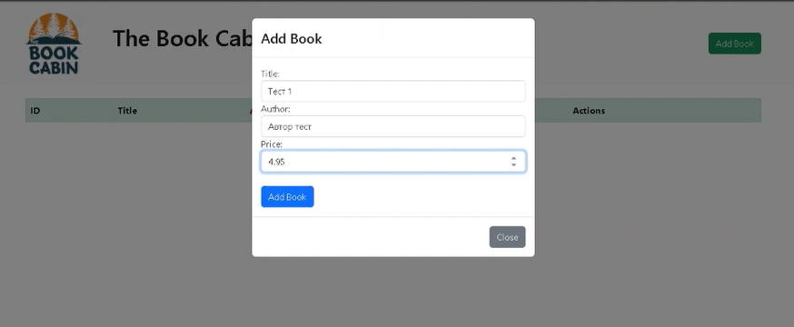
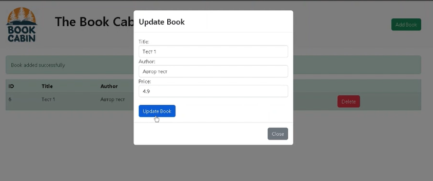
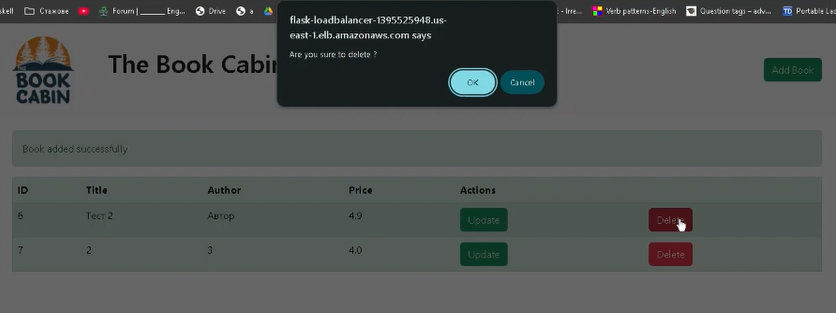

**Тема: Разработка и деплойване на Book Wishlist уеб приложение в AWS
Cloud среда**

Приложно-програмни интерфейси за работа с облачни архитектури с Амазон
Уеб Услуги (AWS)

Изготвил: Мартин Скачков

Лектор: проф. Милен Петров, година: 2025

# Условие

Целта на този проект е да се създаде и деплойне уеб приложение за
управление на списък с желани книги за покупка (Book Wishlist) в Amazon
Web Services (AWS) Cloud среда. Приложението трябва да бъде достъпно
публично през интернет и да използва разпределена архитектура с високa
наличност.

# Въведение

Book Wishlist е Flask-базирано уеб приложение за управление на списък с
желани книги. Приложението предоставя пълна CRUD (Create, Read, Update,
Delete) функционалност, позволявайки на потребителите да добавят,
редактират, прегледат и изтриват книги от техния personal wishlist.
Всяка книга в системата се характеризира с три основни атрибута: автор,
цена и име на книгата.\
\
Основните функционалности включват:

- Добавяне на нови книги към wishlist-а с попълване на автор, име и
  цена.

- Редактиране на съществуващи записи за книги в системата.

- Изтриване на книги, които вече не са от интерес за потребителя.

- Преглед на целия списък с желани книги в удобен табличен формат.

\
Приложението е проектирано за деплойване в AWS облачна среда с акцент
върху сигурност, мащабируемост и висока наличност чрез използване на
разпределена архитектура. Въпреки това, поради ограничения в бюджета,
настоящата имплементация е реализирана само в рамките на една налична
зона (Availability Zone), което ограничава възможността за пълна
устойчивост при евентуални регионални сривове.\

# Теория

Amazon Web Services (AWS) предоставя широк спектър от облачни услуги,
които позволяват създаването на мащабируеми и сигурни приложения.

## Virtual Private Cloud (VPC)

**VPC (Virtual Private Cloud)** е логическа част от AWS облака, която
предоставя контрол върху мрежовата среда, в която се намират ресурсите.
VPC позволява създаването на изолирани мрежи, които могат да се
конфигурират със специфични правила за сигурност и маршрутизация. За
нашия проект използваме VPC архитектура, която осигурява изолирана
мрежова среда с пълен контрол върху IP адресирането, маршрутизацията и
сигурността.

## Subnets (Подмрежи)

**Subnets** са подмрежи в рамките на VPC, които позволяват разделяне на
мрежовия трафик за по-добра сигурност и ефективност. Публичните подмрежи
се използват за ресурси, които трябва да имат интернет достъп, докато
частните подмрежи са за ресурси, които не трябва да имат директен достъп
до интернет. Разпределението на подмрежите в различни Availability Zones
осигурява висока наличност и устойчивост на инфраструктурата.

## Internet Gateway

**Internet Gateway** позволява на ресурсите в публичните подмрежи на
VPC-то да комуникират с интернет. Той осигурява връзката между VPC и
глобалния интернет и е необходим за публичните ресурси (като уеб сървъри
и load balancers), които трябва да бъдат достъпни извън VPC-то.

## NAT Gateway

**NAT Gateway** позволява на ресурсите в частни подмрежи да осъществяват
изходящи връзки към интернет (например за изтегляне на актуализации),
без да бъдат достъпни от интернет. Това осигурява сигурност, като
частните ресурси остават недостъпни отвън, но могат да инициират връзки
към интернет при необходимост.

## Route Tables (Маршрутни таблици)

**Route Tables** са таблици за маршрутизиране, които определят как се
насочва трафикът в мрежата. Те дефинират правилата за движение на
трафика между подмрежите и към интернет. Всяка подмрежа е асоциирана с
route table, която определя накъде да се насочи трафикът спрямо неговата
дестинация.

## Security Groups

**Security Groups** действат като виртуални фаеруоли, които контролират
достъпа до ресурсите на ниво инстанция. Те дефинират inbound и outbound
правила за трафика, позволявайки само ауторизираните връзки. Security
Groups работят на ниво инстанция и са stateful - ако е разрешена входяща
връзка, изходящата част автоматично се разрешава.

## Amazon RDS (Relational Database Service)

**RDS** предлага управлявана база данни, която е по-лесна за поддръжка и
мащабиране от самостоятелно управлявана база данни на EC2. RDS се грижи
за backup-и, патчове, мониторинг и мащабиране автоматично, позволявайки
на разработчиците да се фокусират върху приложението.

## Application Load Balancer (ALB)

**Application Load Balancer** е Layer 7 load balancer, който разпределя
входящия HTTP/HTTPS трафик между множество targets (EC2 инстанции) в
различни Availability Zones. ALB осигурява висока наличност, fault
tolerance и по-добра производителност чрез intelligent routing, health
checks и автоматично failover при проблеми с инстанции.

# Използвани технологии

- **Flask** - Python уеб framework за разработване на приложението.

- **Virtual Private Cloud (VPC)** - Логическа изолирана мрежова среда
  с пълен контрол върху мрежовата конфигурация.

- **Subnets (Подмрежи)** - Подразделение на мрежата за разделяне на
  публичен и частен трафик.

- **Internet Gateway** - Позволява на публичните ресурси да имат
  достъп до интернет.

- **NAT Gateway** - Осигурява изходящ интернет достъп за частни
  ресурси.

- **Route Tables (Маршрутни таблици)** - Определят правилата за
  маршрутизация на мрежовия трафик.

- **Security Groups** - Виртуални фаеруоли за контролиране на достъпа
  до ресурсите.

- **Amazon RDS (MySQL)** - релационна база данни, хоствана чрез Amazon
  RDS.

- **Application Load Balancer (ALB)** - Разпределя мрежовия трафик към
  множество инстанции за по-добра производителност.

# Инсталация и настройки

## Създаване на Virtual Private Cloud (VPC)

**Стъпки:** Създаден е нов VPC с CIDR блок 10.0.0.0/16, който предоставя
достатъчно IP адреси за множество подмрежи (Subnets). Активирани са DNS
hostnames и DNS resolution, за да могат инстанциите в VPC-то да
получават динамични DNS имена и да могат да се свързват с външни
ресурси, ако е необходимо.\
\
**Защо го направихме:** Създаването на VPC е необходимо за изграждане на
изолирана и конфигурирана мрежова среда в AWS. Активирането на DNS
hostnames и DNS resolution осигурява възможността за използване на AWS
предоставени DNS имена за EC2 инстанциите, което е полезно за лесно
управление на ресурси и комуникация между тях.

## Създаване на Subnets

**Стъпки:** Създадени са 4 подмрежи в 2 различни Availability Zones
(AZ):

- Public Subnet 1: 10.0.0.0/24 (us-east-1a)

- Private Subnet 1: 10.0.2.0/24 (us-east-1a)

- Public Subnet 2: 10.0.1.0/24 (us-east-1b)

- Private Subnet 2: 10.0.3.0/24 (us-east-1b)

**Защо го направихме:** Public subnets се използват за ресурси, които
трябва да имат интернет достъп (например EC2). Активиранa е услугата
Auto-assign IP settings за автоматично присвояване на публичен IP адрес
към инстанция, провизионирана в дадения публичен subnet. Private subnets
са за ресурси, които не трябва да имат директен достъп до интернет
(например бази данни). Разпределението на подмрежите в различни
Availability Zones осигурява висока наличност и устойчивост на
инфраструктурата.

## Създаване на Internet Gateway

**Стъпки:** Създаден е Internet Gateway и е прикачен към VPC-то, за да
осигури интернет достъп за публичните подмрежи. Публичните ресурси (като
Application Load Balancer) ще имат възможност да комуникират с интернет
чрез този Internet Gateway.\
\
**Защо го направихме:** Без Internet Gateway, ресурсите в публичните
подмрежи на VPC-то нямат интернет достъп, което може да ограничи
функционалността на приложенията. Internet Gateway е необходим за
публичните ресурси (като уеб сървъри и load balancers), които трябва да
бъдат достъпни извън VPC-то.

## Създаване на NAT Gateway

**Стъпки:** Създадохме Elastic IP и го асоциирахме с NAT Gateway в
Public Subnet 1. Свързахме Private Subnet 1 с NAT Gateway чрез Private
Route Table.

## Създаване на Route Tables

**Стъпки и конфигурация:**

- Public Route Table: Свързахме с Public Subnets и добавихме маршрут
  към Internet Gateway (0.0.0.0/0 → IGW).

- Private Route Table: Свързахме с Private Subnets и добавихме маршрут
  към NAT Gateway (0.0.0.0/0 → NAT Gateway). Това гарантира, че
  трафикът от частните подмрежи ще минава през NAT Gateway за достъп
  до интернет.

**Защо го направихме:** Route Table гарантира, че трафикът от публичните
подмрежи може да излиза към интернет. Маршрутът с Destination: local
осигурява вътрешната комуникация между подмрежите в същото VPC, без да е
необходим интернет достъп.

## Създаване на Security Groups

**Конфигурация:**

- **Security Group за EC2 инстанции:**

  - Inbound Rules:

  - HTTP (80): Разрешено от Application Load Balancer.

  - HTTPS (443): Разрешено от Application Load Balancer.

  - SSH (22): Разрешено само от определен IP адрес (локален
    компютър).

- **Security Group за Application Load Balancer:**

  - Inbound Rules:

  - HTTP (80): Разрешено от всякъде (0.0.0.0/0).

  - HTTPS (443): Разрешено от всякъде (0.0.0.0/0).

- **Security Group за RDS (MySQL):**

  - Inbound Rules:

  - MySQL (3306): Разрешено само от Security Group-а на EC2 (за да
    се осигури достъп само от EC2 инстанции).

Всички outbound правила са разрешени за тези ресурси (по подразбиране).

## Създаване на RDS MySQL Database

**Конфигурация:**

- DB Instance Identifier: flask-db

- Master Username: admin

- Master Password: \[сигурна парола\]

- DB Instance Class: db.t2.micro (Free Tier eligible)

- Storage: 20GB (минимум за Free Tier)

- VPC: Избрано съществуващото WebAppVPC.

- Subnet Group: Избрана групата с Private Subnets.

- Public Access: No (RDS ще бъде достъпна само вътре в VPC).

- Security Group: Security Group за RDS

- Database Name: flask-db

## Създаване на Application Load Balancer

**Конфигурация:**

- Scheme: Internet-facing (публично достъпен)

- IP address type: IPv4

- VPC: Избрано създаденото WebAppVPC

- Availability Zones: Избрани Public Subnet 1 и Public Subnet 2

- Security Groups: Избрана ALB Security Group

- Target Group: Създадена за EC2 инстанцията в Public Subnet 1

- Health Checks: Конфигурирани за HTTP на път \"/health\" или \"/\"

- Port: 80 за HTTP трафик

ALB автоматично проверява здравословното състояние на EC2 инстанциите и
пренасочва трафика само към здравите инстанции. При отказ на една
инстанция, трафикът автоматично се пренасочва към останалите работещи
инстанции, ако има такива (поради липса на средства ние нямаме втора EC2
инстанция).

# Кратко ръководство за потребителя

Book Wishlist приложението предоставя интуитивен и лесен за използване
интерфейс за управление на вашия личен списък с желани книги.
Приложението е достъпно чрез Application Load Balancer URL адреса, който
автоматично разпределя заявките между наличните EC2 инстанции за
оптимална производителност.

## Достъп до приложението

За да започнете да използвате Book Wishlist:

1.  Отворете web browser (Chrome, Firefox, Safari, Edge)

2.  Въведете URL адреса на приложението в адресната лента

3.  Приложението ще се зареди автоматично и ще видите главната страница

## Главна страница

Главната страница показва:

- Заглавие \"The Book Cabin: wishlist for books\" с логото на
  приложението

- Таблица с всички добавени книги, съдържаща колони за ID, Заглавие,
  Автор, Цена и Действия

- Зелен бутон \"Add Book\" в горния десен ъгъл за добавяне на нови
  книги

- Flash съобщения за успешно изпълнени операции (добавяне,
  редактиране, изтриване)

## Добавяне на нова книга

За да добавите нова книга във вашия wishlist:

1.  Кликнете върху зеления бутон \"Add Book\" в горната част на
    страницата

2.  Ще се отвори модален диалог с форма за въвеждане на данни

3.  Попълнете задължителните полета:

    - **Title:** Въведете заглавието на книгата

    - **Author:** Въведете името на автора

    - **Price:** Въведете цената (може да бъде десетично число)

4.  Кликнете бутона \"Add Book\" за да запазите информацията

5.  Модалният диалог ще се затвори и ще видите съобщение \"Book added
    successfully\"

6.  Новата книга ще се появи в таблицата на главната страница

## Редактиране на съществуваща книга

За да редактирате информацията за дадена книга:

1.  В таблицата с книги намерете реда с книгата, която искате да
    редактирате

2.  Кликнете върху зеления бутон \"Update\" в колоната \"Actions\"

3.  Ще се отвори модален диалог с предварително попълнени полета

4.  Променете желаните стойности в полетата Title, Author или Price

5.  Кликнете бутона \"Update Book\" за да запазите промените

6.  Ще видите съобщение \"Book is updated\" и актуализираната информация
    в таблицата

## Изтриване на книга

За да премахнете книга от вашия wishlist:

1.  В таблицата с книги намерете реда с книгата, която искате да
    изтриете

2.  Кликнете върху червения бутон \"Delete\" в колоната \"Actions\"

3.  Ще се появи JavaScript потвърждаващ диалог с въпроса \"Are you sure
    to delete?\"

4.  Кликнете \"OK\" за да потвърдите изтриването или \"Cancel\" за да
    откажете

5.  При потвърждение ще видите съобщение \"Book is deleted\" и книгата
    ще бъде премахната от таблицата

## Навигация и интерфейс

- **Отзивчив дизайн:** Приложението е оптимизирано за различни размери
  на екрана (десктоп, таблет, мобилен)

- **Bootstrap стилизиране:** Използва се модерен и професионален
  дизайн

- **Интуитивни цветове:** Зелени бутони за позитивни действия
  (добавяне, редактиране), червени за опасни действия (изтриване)

- **Flash съобщения:** Всяко действие се потвърждава с ясно съобщение
  за обратна връзка

## Технически изисквания

- Съвременен web browser с поддръжка на JavaScript

- Активна интернет връзка

- Няма нужда от специални plugin-и или допълнителен софтуер

## Възможни грешки и решения

- **Страницата не се зарежда:** Проверете интернет връзката и опитайте
  да презаредите страницата

- **Бутоните не работят:** Уверете се, че JavaScript е активиран в
  браузъра

- **Формите не се изпращат:** Проверете дали сте попълнили всички
  задължителни полета

# Примерни данни

За тестване на функционалността на Book Wishlist приложението са
използвани следните примерни данни:

**Книга 1:**

- Заглавие: \"The Great Gatsby\"

- Автор: \"F. Scott Fitzgerald\"

- Цена: 12.99

**Книга 2:**

- Заглавие: \"To Kill a Mockingbird\"

- Автор: \"Harper Lee\"

- Цена: 14.50

**Книга 3:**

- Заглавие: \"1984\"

- Автор: \"George Orwell\"

- Цена: 13.25

**Книга 4:**

- Заглавие: \"Pride and Prejudice\"

- Автор: \"Jane Austen\"

- Цена: 11.75

Тези примерни данни демонстрират пълната CRUD функционалност на
приложението - добавяне, четене, актуализиране и изтриване на записи.
Всички операции са тествани успешно както локално, така и в AWS cloud
средата.

# Описание на програмния код

## Главен модул (app.py)

Главният модул app.py представлява входната точка на Flask приложението.
Той инициализира Flask приложението, конфигурира връзката с базата данни
чрез SQLAlchemy и регистрира blueprint-а за управление на книгите.

- Импортира необходимите модули: Flask, конфигурационните настройки и
  blueprint за книгите

- Конфигурира SQLALCHEMY_DATABASE_URI от config файла за връзка с
  MySQL RDS

- Инициализира базата данни чрез db.init_app(app)

- Регистрира book_bp blueprint за маршрутизиране на HTTP заявките

- Стартира приложението в debug режим при директно изпълнение

## Конфигурационен модул (config.py)

Конфигурационният модул централизира всички настройки на приложението,
като импортира чувствителните данни от отделен secrets_config модул.

- SQLALCHEMY_DATABASE_URI: Формира connection string за MySQL базата
  данни в AWS RDS

- SQLALCHEMY_TRACK_MODIFICATIONS: Изключен за по-добра
  производителност

- SECRET_KEY: Използва се за сесийна сигурност и CSRF защита

## Модул за чувствителни данни (secrets_config.py)

Съдържа всички чувствителни конфигурационни данни като потребителски
имена, пароли и ключове. В производствена среда този файл трябва да бъде
изключен от version control системата.

- username: Потребителско име за MySQL базата данни

- password: Парола за достъп до базата данни

- host: AWS RDS endpoint за връзка с базата данни

- db: Име на базата данни

- secret_key: Уникален ключ за Flask сесийна сигурност

## Модел за данни (book.py)

Book класът наследява db.Model и дефинира структурата на таблицата за
книги в базата данни.

- id: Primary key, автоматично генерирано цяло число

- title: Заглавие на книгата (String(100), задължително поле)

- author: Автор на книгата (String(100), задължително поле)

- price: Цена на книгата (Float, опционално поле)

- \_\_init\_\_: Конструктор за създаване на нови инстанции на Book

## Услуги за управление на книги (book_services.py)

Този модул съдържа всички HTTP маршрути и бизнес логика за CRUD операции
с книги.

### Маршрут index() - '/'

- Извлича всички книги от базата данни чрез Book.query.all()

- Предава данните към index.html шаблона

- Показва главната страница с таблица от всички книги

### Маршрут insert_book() - '/add/'

- Обработва POST заявки за добавяне на нова книга

- Създава нова Book инстанция с данни от формата

- Добавя записа в базата данни и commit-ва промените

- Показва flash съобщение за успешно добавяне

- Пренасочва към главната страница

### Маршрут update_book() - '/update/'

- Обработва POST заявки за актуализиране на съществуваща книга

- Търси книгата по ID чрез Book.query.get()

- Актуализира полетата с нови стойности от формата

- Commit-ва промените в базата данни

- Показва flash съобщение за успешна актуализация

### Маршрут delete() - '/delete/\<id\>/'

- Обработва GET и POST заявки за изтриване на книга

- Търси книгата по подаденото ID

- Изтрива записа от базата данни

- Commit-ва промените

- Показва flash съобщение за успешно изтриване

## HTML шаблони

Приложението използва Jinja2 шаблонна система за генериране на динамично
HTML съдържание.

### base.html

Основният шаблон, който се наследява от всички други страници. Включва
Bootstrap CSS/JS библиотеки за стилизиране и отзивчив дизайн.

### navbar.html

Навигационната лента, която съдържа логото на приложението и бутон за
добавяне на нова книга чрез модален диалог.

### index.html

Главната страница, която показва таблица с всички книги и включва
функционалности за редактиране и изтриване на всеки запис.

### insert_book_modal.html

Модален диалог за добавяне на нова книга с форма, която изпраща POST
заявка към /add/ маршрута.

### update_book_modal.html

Модален диалог за редактиране на съществуваща книга, който се генерира
динамично за всеки запис в таблицата.

# Приноси на студента, ограничения и възможности за бъдещо развитие

## Приноси на студента

В рамките на този проект са реализирани следните постижения:

- Проектирана и имплементирана пълна cloud архитектура в AWS с висока
  наличност

- Създадено функционално Flask уеб приложение с пълна CRUD
  функционалност

- Конфигурирана сигурна мрежова архитектура с VPC, подмрежи и Security
  Groups

- Внедрена управлявана MySQL база данни чрез Amazon RDS

- Настроен Application Load Balancer за разпределяне на трафика

- Осигурена изолация между публични и частни ресурси чрез правилна
  мрежова сегментация

- Създаден отзивчив потребителски интерфейс с Bootstrap framework

## Ограничения

Поради бюджетни ограничения и практически съображения, настоящата
имплементация има следните ограничения:

- Използва се само една EC2 инстанция, което ограничава възможността
  за автоматично мащабиране

- Липсва Multi-AZ deployment за RDS базата данни

- Няма резервни копия и disaster recovery план

- Не са внедрени автоматични мониторинг и алертинг системи

- Липсва HTTPS сертификат за сигурна комуникация

- Не е внедрена потребителска аутентификация и авторизация

## Възможности за бъдещо развитие

Приложението може да бъде значително подобрено в следните направления:

- **Мащабируемост:** Добавяне на Auto Scaling Groups за автоматично
  мащабиране на EC2 инстанциите при промяна в натоварването

- **Сигурност:** Внедряване на SSL/TLS с Amazon Certificate Manager за
  HTTPS комуникация

- **Потребителско управление:** Добавяне на потребителска регистрация,
  вход и персонализирани wishlist-и

- **База данни:** Преминаване към Multi-AZ RDS deployment за по-висока
  наличност

- **Мониторинг:** Внедряване на CloudWatch за мониторинг на
  производителността и автоматични alert-и

- **CDN:** Използване на Amazon CloudFront за кеширане и по-бърза
  доставка на съдържание

- **Функционалност:** Добавяне на търсене, филтриране, категории и
  рейтинг система за книгите

- **API:** Разработване на RESTful API за мобилни приложения

- **DevOps:** Внедряване на CI/CD pipeline с AWS CodePipeline за
  автоматично деплойване

# Какво научих

Чрез изпълнването на този проект придобих ценни знания и умения в
областта на cloud computing и web development:

## AWS Cloud Services

- Практическо разбиране на AWS архитектурни принципи и best practices

- Умения за проектиране и конфигуриране на VPC мрежова архитектура

- Опит с различни AWS услуги: EC2, RDS, ALB, VPC, Security Groups

- Разбиране на важността на мрежовата сигурност и изолация в cloud
  средата

- Научих как да балансирам между функционалност и разходи в cloud
  решенията

## Web Development

- Задълбочени знания за Flask framework и MVC архитектурен модел

- Практически опит с SQLAlchemy ORM за управление на бази данни

- Умения за създаване на responsive web design с Bootstrap

- Разбиране на важността на добрата структура на кода и разделението
  на отговорностите

## DevOps и Infrastructure

- Опит с cloud deployment и конфигуриране на production среда

- Разбиране на важността на мониторинга и логирането в производствени
  системи

- Знания за мрежова сигурност и firewall конфигурации

- Практически опит с load balancing и high availability архитектури

## Професионални умения

- Подобрени умения за решаване на проблеми и debugging

- Опит с четене и анализиране на техническа документация

- Разбиране на важността на планирането и архитектурното проектиране

- Усетът за балансиране между техническите изисквания и практическите
  ограничения

## Бъдещи стъпки

Този проект ми даде солидна основа за по-нататъшно развитие в областта
на cloud computing. Планирам да продължа да изучавам advanced AWS услуги
като Lambda, API Gateway, CloudFormation и да се фокусирам върху
автоматизация и DevOps практики. Също така искам да надградя познанията
си в областта на container технологии като Docker и Kubernetes за
по-ефективно управление на приложенията в cloud средата.

# Списък с фигури и таблици

# Използвани източници

[\[1\] Amazon VPC User Guide - AWS
Documentation](https://docs.aws.amazon.com/vpc/latest/userguide/what-is-amazon-vpc.html)

[\[2\] Application Load Balancer - AWS
Documentation](https://docs.aws.amazon.com/elasticloadbalancing/latest/application/introduction.html)

[\[3\] Amazon RDS User Guide - AWS
Documentation](https://docs.aws.amazon.com/AmazonRDS/latest/UserGuide/Welcome.html)

[\[4\] Flask Documentation - Web Development with
Python](https://flask.palletsprojects.com/en/2.3.x/)

[\[5\] Amazon EC2 Security Groups - AWS
Documentation](https://docs.aws.amazon.com/AWSEC2/latest/UserGuide/ec2-security-groups.html)

[\[6\] NAT Gateways - Amazon VPC User
Guide](https://docs.aws.amazon.com/vpc/latest/userguide/vpc-nat-gateway.html)

[\[7\] Internet Gateways - Amazon VPC User
Guide](https://docs.aws.amazon.com/vpc/latest/userguide/VPC_Internet_Gateway.html)

[\[8\] AWS Well-Architected
Framework](https://aws.amazon.com/architecture/well-architected/)

[\[9\] Route Tables - Amazon VPC User
Guide](https://docs.aws.amazon.com/vpc/latest/userguide/VPC_Route_Tables.html)

[\[10\] PyMySQL Documentation - Python MySQL Client
Library](https://pymysql.readthedocs.io/en/latest/)
